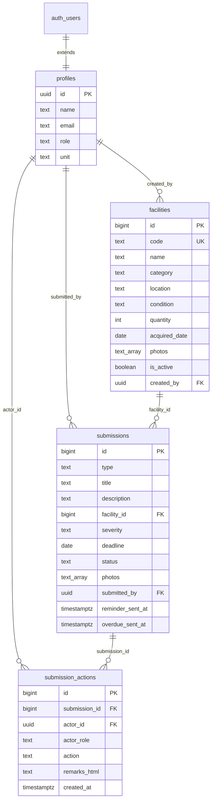

# Model Data

Empat tabel di Postgres Supabase. RLS aktif di semuanya — lihat [03-security.md](03-security.md).

Selain tabel, ada empat fungsi workflow yang menjalankan setiap transisi sebagai satu transaksi (`supabase/migrations/0005_workflow.sql`). Alasan dan pembatasan hak aksesnya ada di [03-security.md](03-security.md#server-actions-dan-rpc).

## ERD



---

## `profiles`

Ekstensi `auth.users`. Supabase tidak mengizinkan kolom custom di tabel auth, jadi data aplikasi tinggal di sini.

```sql
create table profiles (
  id         uuid primary key references auth.users(id) on delete cascade,
  name       text not null,
  email      text not null,
  role       text not null check (role in ('requester','reviewer','approver','admin')),
  unit       text,
  created_at timestamptz not null default now()
);
```

`unit` menyimpan unit atau gedung penanggung jawab. Saat ini dipakai sebagai label dan filter tampilan, **bukan** untuk membatasi akses — reviewer melihat semua pengajuan yang menunggu review. Kalau nanti perlu pembatasan per unit, tambahkan kondisi `unit` di policy `submissions`.

Baris `profiles` dibuat lewat trigger `on auth.users insert`, supaya tidak ada user tanpa profil.

---

## `facilities` — master sarana fasilitas

```sql
create table facilities (
  id            bigint primary key generated always as identity,
  code          text not null unique,
  name          text not null,
  category      text not null,
  location      text not null,
  condition     text not null check (condition in ('baik','rusak_ringan','rusak_berat')),
  quantity      int  not null default 1,
  acquired_date date,
  notes         text,
  photos        text[] not null default '{}',
  is_active     boolean not null default false,
  created_by    uuid not null references profiles(id),
  created_at    timestamptz not null default now(),
  updated_at    timestamptz not null default now()
);

create index on facilities (is_active, category);
create index on facilities (location);
```

| Kolom | Catatan |
|---|---|
| `code` | Kode aset, mis. `AC-GD1-004`. Unik, jadi acuan manusia |
| `category` | AC / Meubel / Elektronik / Bangunan / Kendaraan — teks bebas, belum perlu tabel referensi |
| `condition` | Kondisi terakhir yang diketahui |
| `photos` | Path di Supabase Storage, bukan URL — URL bertanda tangan dibuat saat render |

### Kenapa `is_active`, bukan tabel staging

Saat user mengajukan **data sarana baru**, baris `facilities` dibuat **langsung** dengan `is_active = false`. Approver menyetujui → jadi `true` dan muncul di master. Ditolak → user merevisi baris yang sama.

Konsekuensinya:

- Tidak ada tabel staging, tidak ada kolom `jsonb` payload, tidak ada penyalinan data saat approve
- `submissions.facility_id` selalu terisi untuk **kedua** jenis pengajuan
- Satu indeks `is_active` memisahkan master resmi dari yang masih diajukan

Alternatif yang ditolak: menyimpan calon aset sebagai `jsonb` di `submissions` lalu `INSERT` ke `facilities` saat approve. Itu berarti field aset tidak bisa di-query atau divalidasi database sampai disetujui, dan logika penyalinan harus dijaga sinkron dengan skema.

---

## `submissions` — satu tabel untuk kedua jenis pengajuan

```sql
create table submissions (
  id               bigint primary key generated always as identity,
  type             text not null check (type in ('damage','asset')),
  title            text not null,
  description      text not null,
  facility_id      bigint not null references facilities(id),
  severity         text check (severity in ('ringan','sedang','berat')),
  deadline         date not null,
  status           text not null default 'pending_review'
                   check (status in ('pending_review','pending_approval','approved','rejected')),
  photos           text[] not null default '{}',
  submitted_by     uuid not null references profiles(id),
  reminder_sent_at timestamptz,
  overdue_sent_at  timestamptz,
  created_at       timestamptz not null default now(),
  updated_at       timestamptz not null default now(),

  -- Severity rates damage. An asset registration has nothing to rate.
  constraint severity_only_for_damage
    check (type <> 'asset' or severity is null),
  constraint severity_required_for_damage
    check (type <> 'damage' or severity is not null)
);

create index on submissions (status, deadline);
create index on submissions (submitted_by);
create index on submissions (facility_id);
```

`facility_id` selalu terisi:

- `type = 'damage'` → menunjuk facility yang sudah ada di master (`is_active = true`)
- `type = 'asset'` → menunjuk facility baru yang masih `is_active = false`

Relasi itu dijaga trigger `submissions_guard_facility` saat insert, bukan sekadar konvensi: damage wajib menunjuk facility yang sudah terbit, asset wajib menunjuk draft milik pengaju sendiri yang belum terbit. Ditaruh di trigger supaya berlaku juga untuk tulisan dari service role.

**Empat status saja.** Detail *siapa* menolak dan *di tahap mana* ada di `submission_actions` — tidak perlu `rejected_review` dan `rejected_approval` terpisah. Lihat [02-workflow.md](02-workflow.md).

Trigger `submissions_guard_immutables` mengunci `deadline`, `type`, `submitted_by`, dan `facility_id` setelah insert. `status` sengaja dibiarkan bergerak — itulah satu-satunya kolom yang alur kerja memang perlu ubah.

Indeks `(status, deadline)` melayani query cron harian sekaligus filter daftar.

---

## `submission_actions` — audit trail + remarks

```sql
create table submission_actions (
  id            bigint primary key generated always as identity,
  submission_id bigint not null references submissions(id) on delete restrict,
  actor_id      uuid not null references profiles(id),
  actor_role    text not null,
  action        text not null check (action in ('submit','resubmit','approve','reject')),
  remarks_html  text,
  created_at    timestamptz not null default now()
);

create index on submission_actions (submission_id, created_at);
```

Satu tabel ini melayani reviewer maupun approver sekaligus, dan menjadi riwayat lengkap yang ditampilkan sebagai timeline di halaman detail.

`actor_role` disimpan sebagai snapshot — kalau role user berubah suatu saat, catatan lama tetap menunjukkan kapasitas apa yang dia pakai waktu itu.

`remarks_html` berisi HTML yang **sudah disanitasi di server**. Wajib terisi saat `action = 'reject'`, opsional saat approve.

Aturan itu ditegakkan di **dua** tempat: Server Action memvalidasi lebih dulu supaya pesan errornya manusiawi, dan constraint `reject_requires_remarks` menjadi jaring pengaman terakhir — termasuk menolak `<p><br></p>` yang dihasilkan contenteditable kosong.

```sql
constraint reject_requires_remarks
  check (action <> 'reject'
         or coalesce(length(regexp_replace(remarks_html, '<[^>]*>', '', 'g')), 0) > 0)
```

FK memakai `on delete restrict`, bukan `cascade`: trigger append-only di bawah akan menggagalkan cascade delete, jadi `restrict` menyatakan aturan sebenarnya — submission yang punya riwayat tidak bisa dihapus.

Tabel ini append-only untuk **semua**, service role sekalipun, ditegakkan trigger `submission_actions_append_only` yang menolak `UPDATE` dan `DELETE`.

---

## Storage

Satu bucket privat: `facility-photos`. Batas 10 MB, MIME dibatasi ke `image/jpeg|png|webp|heic`.

```
{auth.uid()}/{uuid}.{ext}
```

Folder dikunci ke **uploader**, bukan ke submission: upload terjadi saat user masih mengisi form, sebelum baris `submissions` ada, jadi tidak ada submission id untuk dijadikan kunci.

Akses lewat signed URL berumur pendek yang dibuat di server. Bucket privat, bukan publik — foto kerusakan bisa memuat informasi lokasi internal.

`facilities.photos` dan `submissions.photos` menyimpan **path**, bukan URL. Menyimpan URL bertanda tangan akan basi.

Tidak ada tabel `attachments` terpisah: foto tidak punya siklus hidup, metadata, atau relasi sendiri. Kalau nanti perlu caption atau urutan per foto, barulah pecah jadi tabel.
