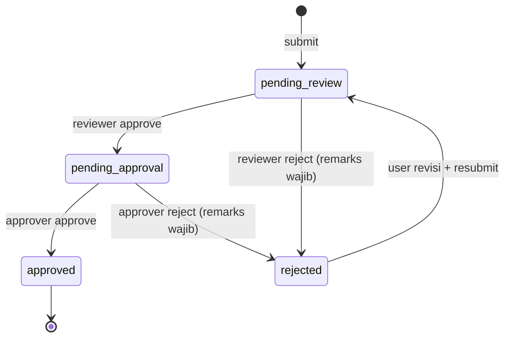

# Alur Kerja

## Mesin status



Empat status, satu jalur, tidak ada cabang tersembunyi.

| Status | Arti | Menunggu siapa |
|---|---|---|
| `pending_review` | Sudah diajukan, belum ditinjau | Reviewer |
| `pending_approval` | Lolos review, menunggu keputusan akhir | Approver |
| `approved` | Disetujui. **Terminal** | — |
| `rejected` | Ditolak, menunggu perbaikan | Requester (pemilik) |

### Kenapa hanya satu status `rejected`

Ditolak reviewer dan ditolak approver terasa berbeda, tapi bagi requester keduanya berarti hal yang sama: *perbaiki lalu ajukan lagi*. Siapa yang menolak, dengan kapasitas apa, dan alasannya sudah tercatat lengkap di `submission_actions` dan tampil di timeline. Menambah status per tahap hanya menggandakan cabang di setiap query dan setiap badge UI tanpa memberi informasi baru.

### Revisi selalu kembali ke reviewer

`rejected` + resubmit → `pending_review`, **selalu** — meskipun yang menolak adalah approver.

Alasannya: kalau approver menolak lalu revisi langsung lompat ke approver, reviewer tidak pernah melihat versi yang berubah. Reviewer adalah pemeriksa kelengkapan; melewatinya berarti versi final bisa lolos tanpa pernah diperiksa.

---

## Aturan deadline

| Aturan | Nilai |
|---|---|
| Default | Tanggal submit + 7 hari |
| Bisa diubah | Ya, saat input. Tidak boleh tanggal lampau |
| Titik hitung | Tanggal submit pertama |
| Saat revisi | **Tidak direset** |
| Berhenti dihitung | Saat status jadi `approved` |

**Deadline tidak direset saat revisi.** Kalau direset, penolakan jadi celah untuk mengulur waktu: ajukan asal-asalan, kena reject, dapat 7 hari baru. Dengan deadline tetap, tekanan waktu justru mendorong pengajuan yang benar sejak awal.

Karena `approved` adalah status terminal dan hitungan mulai dari submit, deadline berarti: *pengajuan ini harus tuntas disetujui dalam N hari*. Deadline lewat sementara status masih `pending_review` atau `pending_approval` menandakan yang telat adalah **proses persetujuan**, dan notifikasi memang dikirim ke reviewer/approver yang menahan, bukan hanya ke pelapor. Lihat [04-notifications.md](04-notifications.md).

Kolom turunan yang ditampilkan di UI, dihitung saat render (tidak disimpan):

```
sisa_hari = deadline - today
```

- `> 3` → netral
- `0..3` → peringatan
- `< 0` → merah, "Terlambat N hari"

Untuk `approved`, indikator ini tidak ditampilkan.

---

## Matriks aksi per role

| Aksi | requester | reviewer | approver | admin |
|---|:---:|:---:|:---:|:---:|
| Buat pengajuan | ✅ | — | — | ✅ |
| Lihat pengajuan sendiri | ✅ | ✅ | ✅ | ✅ |
| Lihat pengajuan orang lain | — | ✅ | ✅ | ✅ |
| Revisi + resubmit | ✅ (miliknya, saat `rejected`) | — | — | — |
| Approve/reject di `pending_review` | — | ✅ | — | ✅ |
| Approve/reject di `pending_approval` | — | — | ✅ | ✅ |
| Lihat master facilities aktif | ✅ | ✅ | ✅ | ✅ |
| Kelola user & role | — | — | — | ✅ |

Panel aksi di halaman detail hanya muncul kalau role user **dan** status pengajuan cocok. Penegakan sebenarnya ada di Server Action dan RLS — UI hanya menyembunyikan, bukan mengamankan. Lihat [03-security.md](03-security.md).

`admin` bisa bertindak di kedua tahap sebagai jalur darurat saat reviewer atau approver berhalangan. Setiap tindakan admin tetap tercatat di `submission_actions` dengan `actor_role = 'admin'`, jadi terlihat jelas di timeline.

---

## Aturan remarks

- Editor WYSIWYG: bold, italic, list, link. Tidak lebih.
- **Wajib** saat reject — tombol submit dialog nonaktif sampai terisi.
- **Opsional** saat approve.
- Disimpan sebagai HTML yang sudah disanitasi di server.
- Tidak bisa diedit atau dihapus setelah tersimpan. Ini catatan audit, bukan komentar.

---

## Form pengajuan

Toggle jenis di bagian atas form menentukan field yang tampil.

**Laporan kerusakan**

| Field | Wajib |
|---|:---:|
| Facility (combobox dari master aktif) | ✅ |
| Judul | ✅ |
| Tingkat kerusakan (ringan/sedang/berat) | ✅ |
| Deskripsi | ✅ |
| Foto | — |
| Deadline (prefill `today + 7`) | ✅ |

**Data sarana fasilitas**

| Field | Wajib |
|---|:---:|
| Kode aset | ✅ |
| Nama | ✅ |
| Kategori | ✅ |
| Lokasi | ✅ |
| Kondisi | ✅ |
| Jumlah (default 1) | ✅ |
| Tanggal perolehan | — |
| Catatan | — |
| Foto | — |
| Deadline (prefill `today + 7`) | ✅ |

Submit jenis `asset` membuat baris `facilities` (`is_active = false`) dan baris `submissions` dalam satu transaksi. Kalau salah satu gagal, keduanya batal — jangan sampai ada facility yatim tanpa pengajuan.
